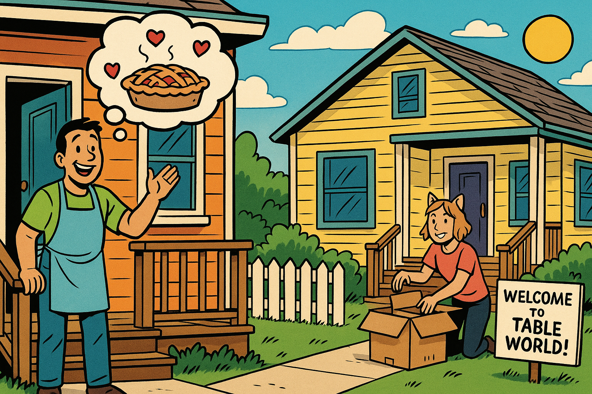
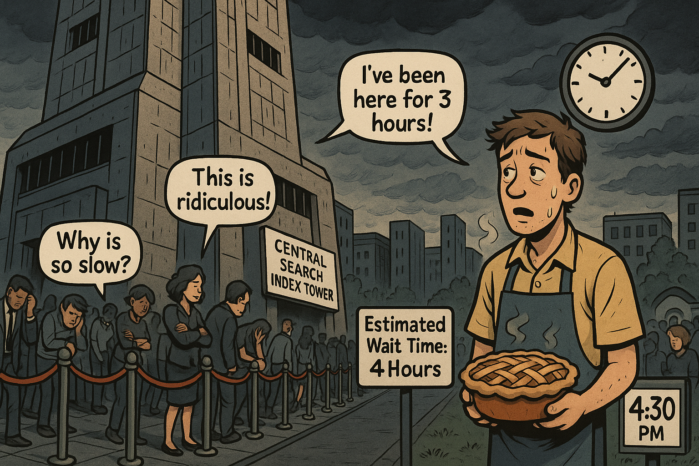
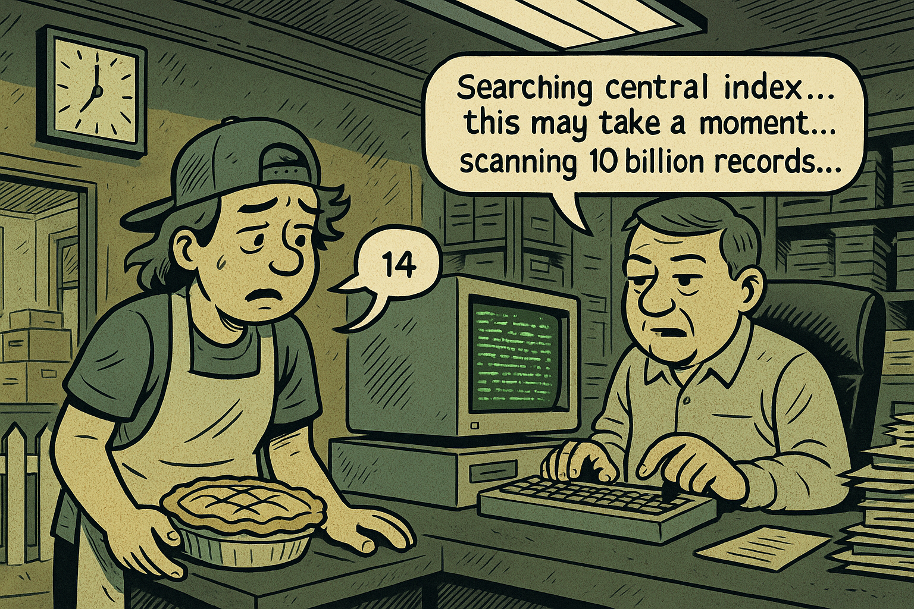
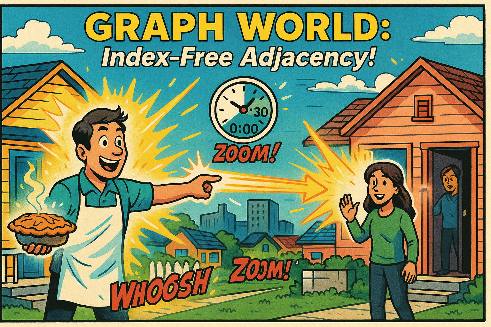

# The Neighborhood Walk

A fun metaphor to explain index-free adjacency to everyone!

## Panel 1: A New Neighbor Arrives

 
A New Neighbor Arrives

Panel 1
Generate a wide-landscape drawing in the style of a comic book. The image should be consistent in style with other images in this session.

Split scene showing two adjacent houses in a cheerful suburban neighborhood. On the left, our protagonist (a friendly person in casual clothes with an apron) waves from their front porch. On the right, a cute new neighbor is unpacking boxes on their porch. There's a white picket fence between the properties. Thought bubble above the protagonist shows a steaming apple pie with hearts around it. The houses are close - maybe 30 feet apart. A sign in the neighbor's yard reads "Welcome to Table World!" The sky is bright and sunny, with a few fluffy clouds.

Alex had been watching the moving truck all morning from their kitchen window. When the last box was carried inside, they knew exactly what to do - Grandma's famous apple pie recipe, the perfect welcome gift! The sweet smell of cinnamon and baked apples soon filled the house as Alex pulled the golden-crusted masterpiece from the oven. Their new neighbor's house was right there, just thirty feet away across the lawn.

## Panel 2: The Wall of Rules

 
The Wall of Rules

Panel 2
Generate a wide-landscape drawing in the style of a comic book. The image should be consistent in style with other images in this session.

Our protagonist, now holding a beautiful steaming apple pie with heat waves rising from it, approaches the property line between the houses. Suddenly, a stern-looking police officer in an old-fashioned uniform appears, holding a large red STOP sign. The officer has an exaggerated serious expression with furrowed brows. Behind the officer is a large official-looking sign that reads "TABLE WORLD REGULATIONS: All visits require Central Index Lookup. Direct access PROHIBITED!" The protagonist looks confused and disappointed. The neighbor can be seen in the background through their window, looking friendly. A small clock in the corner shows it's 2:00 PM.

With the pie carefully balanced in both hands, Alex stepped onto the front porch and started down the walkway toward their neighbor's house. But before they could even reach the property line, a stern police officer materialized out of nowhere, thrust out a large STOP sign, and pointed to an official notice board. "No direct access in Table World," the officer barked, blocking the path completely.

## Panel 3: The Bureaucratic Detour

 
The Bureaucratic Detour

Panel 3
Generate a wide-landscape drawing in the style of a comic book. The image should be consistent in style with other images in this session.

The police officer is pointing authoritatively toward a distant city skyline visible on the horizon. In the far distance, there's an ominous, brutalist concrete tower that rises above all other buildings - dark gray and imposing with small rectangular windows. The officer has a speech bubble saying "You must visit the CENTRAL SEARCH INDEX TOWER downtown!" The protagonist looks dismayed, still holding the pie (steam still rising but slightly less). A helpful road sign in the foreground shows "Central Search Index Tower: 2 Hours" with an arrow pointing away. The cheerful neighborhood is in the foreground, while the dystopian city looms in the distance.

Alex's heart sank as the officer explained the rules of Table World. Every single visit, every connection between neighbors, required a trip to the Central Search Index Tower downtown to look up the proper coordinates. The officer pointed toward the distant cityscape where a massive, brutalist concrete structure loomed menacingly over everything else. Two hours away, minimum, according to the road sign.

## Panel 4: The Long Journey

 
The Long Journey

Panel 4
Generate a wide-landscape drawing in the style of a comic book. The image should be consistent in style with other images in this session.

A montage panel showing the protagonist's journey downtown. The panel is divided into three vignettes: Top left shows them walking past suburban houses that gradually give way to buildings. Top right shows them on a crowded bus or subway looking tired. Bottom shows them finally arriving at the base of the massive Central Search Index Tower - a brutalist concrete monstrosity with angular architecture, small windows, and an unwelcoming appearance. The tower looms overhead menacingly. The protagonist is sweating, looking exhausted, and the pie now has significantly less steam rising from it. A small clock shows it's now 4:00 PM. Other tired people are visible in the background.

The journey was grueling. Alex trudged through suburban streets that gradually gave way to concrete and glass, squeezed onto a packed subway car, and finally emerged two hours later at the base of the tower. The Central Search Index Tower was even more intimidating up close - a massive concrete fortress with tiny windows that seemed to absorb all light and hope. The apple pie, once gloriously hot and fragrant, was now merely warm, and Alex's arms ached from carrying it for so long.

## Panel 5: The Endless Queue

 
The Endless Queue

Panel 5
Generate a wide-landscape drawing in the style of a comic book. The image should be consistent in style with other images in this session.

A wide shot showing an incredibly long line of people snaking around the outside of the Central Search Index Tower. The line has velvet ropes like at a movie theater. People in line look bored, angry, frustrated, or sleeping while standing. Some are checking watches, others have their heads in their hands. Our protagonist is near the back of the line, looking exhausted and holding the pie (barely any steam now). Speech bubbles show people complaining: "I've been here for 3 hours!", "This is ridiculous!", "Why is this so slow?". A sign reads "Estimated Wait Time: 4 Hours". The clock shows 4:30 PM. Dark clouds are starting to gather in the sky.

But arriving at the tower was only the beginning. A massive queue of people snaked around the building like a depressed parade, all waiting for their turn at the Central Search Index. Alex took their place at the back of the line, watching as people ahead checked their watches, sighed dramatically, or simply stared into space with defeated expressions. Four hours, the sign said, and judging by the glacial pace of the line, that might be optimistic.

## Panel 6: The Green Screen of Despair

 
The Green Screen of Despair

Panel 6
Generate a wide-landscape drawing in the style of a comic book. The image should be consistent in style with other images in this session.

Interior of the Central Search Index Tower. Our protagonist has finally reached the front desk counter. Behind thick plexiglass sits a bored-looking clerk in front of a massive, ancient computer with a glowing green monochrome screen displaying rows of data (like an old mainframe terminal). The keyboard is huge and clunky. Filing cabinets and stacks of papers fill the background. The protagonist is giving their neighbor's address. The clerk is slowly typing with one finger. Speech bubble from clerk: "Searching central index... this may take a moment... scanning 10 billion records..." The pie is now visibly cold with NO steam. Clock shows 8:00 PM. Fluorescent lights buzz overhead.

When Alex finally reached the front of the line, legs trembling with exhaustion, they found themselves facing a bored clerk behind thick plexiglass. The clerk sat in front of an ancient computer system with a glowing green screen that looked like it belonged in a museum. "Address?" the clerk droned, and began hunt-and-peck typing into the massive keyboard at an agonizingly slow pace while the mainframe system searched through billions of records. The apple pie was now completely cold, and Alex's stomach growled - they hadn't eaten anything since breakfast.

## Panel 7: Arrival with Cold Pie

 
Arrival with Cold Pie

Panel 7
Generate a wide-landscape drawing in the style of a comic book. The image should be consistent in style with other images in this session.

It's now nighttime (stars and moon visible). The protagonist finally arrives at the neighbor's door, looking completely exhausted and disheveled. They're holding the pie which now has a visible frost layer on top (small icicles) - it's gone completely cold. The neighbor opens the door, looking concerned and sympathetic. Speech bubble from neighbor: "Oh my! Is that... frozen? You poor thing! How long did this take you?" Speech bubble from protagonist: "Eight hours... had to go to the Central Index Tower..." Clock in the corner shows 10:00 PM. The neighbor has a sad but kind expression. A single tear rolls down the protagonist's cheek.

Armed with the coordinates at last, Alex made the two-hour journey back to the neighborhood, arriving at their neighbor's door at 10 PM. Eight hours had passed since they'd first pulled the pie from the oven. The neighbor, Sam, opened the door with a look of shock and concern - the pie had actually frozen in the evening chill, with tiny icicles forming on the crust. "You went through all that just to bring me a pie?" Sam asked, incredulous and touched.

## Panel 8: The Revelation

 
The Revelation

Panel 8
Generate a wide-landscape drawing in the style of a comic book. The image should be consistent in style with other images in this session.

Inside the neighbor's cozy kitchen. They're sitting at a table with the thawed (but still cold) pie between them. The neighbor is leaning forward excitedly, pointing to a colorful poster on the wall that shows "GRAPH WORLD" with happy people hopping between connected nodes/houses. The poster looks vibrant and inviting - the opposite of Table World. Speech bubble from neighbor with bright, exciting text: "Haven't you heard about GRAPH DATABASES? In GRAPH WORLD, you can just POINT and HOP directly to any neighbor! No index lookups needed!" The protagonist's eyes are wide with amazement and curiosity. Little sparkle effects around the neighbor's head show this is an exciting revelation. A glowing diagram on the poster shows connected nodes with arrows and the word "POINTERS!"

Make SURE you do a wide-landscape rendering.

Sam invited Alex inside and insisted on heating up the pie while they talked. Over warm slices and hot coffee, Sam asked about the journey, shaking their head in disbelief at the description of the Central Search Index Tower. "Haven't you heard about Graph World?" Sam asked, eyes lighting up as they gestured to a colorful poster on their kitchen wall. "I just moved here from there - in Graph World, we have something called index-free adjacency. You just point directly to where you want to go, and boom! You're there in seconds!" Alex leaned forward, fascinated, as Sam explained how memory pointers worked like instant transporters.

## Panel 9: Instant Transport!

 
Instant Transport!

Panel 9
Generate a wide-landscape drawing in the style of a comic book. The image should be consistent in style with other images in this session.

Next day, bright sunny morning in GRAPH WORLD - the scene looks more colorful and vibrant than Table World. The protagonist stands at their front door with a NEW steaming hot apple pie (lots of heat waves). They simply POINT toward the neighbor's house. A glowing pointer arrow/ray shoots from their hand directly to the neighbor's house. Comic book style "WHOOSH!" and "ZOOM!" sound effects. The protagonist is instantly transported (Star Trek transporter-style sparkles) in a split second, appearing at the neighbor's door. A banner at the top reads "GRAPH WORLD: Index-Free Adjacency!" A stopwatch graphic shows "0:00:30 - 30 SECONDS!" No police officer. No barriers. Pure freedom! The neighbor is already at the door smiling and welcoming them.

Make SURE you do a wide-landscape rendering.

The next morning, Alex woke up to discover that overnight, their neighborhood had been upgraded to Graph World. Excited to test out the new system, Alex baked another apple pie - Grandma's recipe deserved a proper debut! This time, standing on the front porch with the steaming pie, Alex simply pointed toward Sam's house. A glowing pointer ray shot from their hand, and in a brilliant flash of sparkles, Alex was instantly transported to Sam's doorstep - the whole journey took exactly thirty seconds! The pie was still hot, Alex was smiling, and Sam was already opening the door with a knowing grin.

## Panel 10: The Happy Ending

 
The Happy Ending

Panel 10
Generate a wide-landscape drawing in the style of a comic book. The image should be consistent in style with other images in this session.

Split comparison panel. TOP HALF labeled "TABLE WORLD: 8 HOURS" shows a gloomy, grayed-out scene: the Central Search Index Tower in the background, the long line, exhausted protagonist, cold frozen pie, sad faces. Annotations point to elements: "Index Lookup Required", "Scales Poorly", "Slow & Bureaucratic". BOTTOM HALF labeled "GRAPH WORLD: 30 SECONDS" shows bright, cheerful colors: both neighbors happily eating HOT apple pie together on the porch, smiling and laughing. Direct pointer arrow shown between houses. Annotations read: "Direct Pointer Following", "Constant Time O(1)", "SUPER FAST!". At the bottom, a conclusion banner states: "In Graph Databases, relationships are just memory pointers - one of the fastest operations in computer science! More data ≠ Slower queries!" Both neighbors give thumbs up in Graph World.

Make SURE you do a wide-landscape rendering.

As Alex and Sam sat on the porch enjoying hot apple pie and fresh coffee, Alex couldn't help but marvel at the difference. Yesterday: eight hours of bureaucratic nightmare, waiting in lines, consulting ancient mainframes, and ending with frozen pie. Today: thirty seconds of pure, simple efficiency, resulting in happy neighbors and hot pie. Sam explained that in Graph World, relationships between things were stored as direct memory pointers - just like pointers in computer memory - which meant traversing connections was one of the fastest operations possible, and it didn't slow down no matter how much data you added to the system.

---

## The Technical Takeaway

This graphic novel illustrates the fundamental difference between traditional relational databases (RDBMS) and graph databases:

**Table World (RDBMS)**

- Requires index lookups to find related data EVERY TIME A QUERY IS EXECUTED!
- Must query central indexes for each relationship
- Performance degrades as data grows
- Multiple lookups required for connected data

**Graph World (Index-Free Adjacency)**

- Relationships stored as direct memory pointers that are calculated ONCE WHEN THE DATA IS LOADED!
- No index lookup required for traversals "Index Free" lookup for traversing to an adjacent node
- Constant-time relationship traversal O(1)
- Performance doesn't degrade with data size (given sufficient RAM)

Index-free adjacency makes graph databases extraordinarily fast for relationship-heavy queries - like delivering hot apple pies to your neighbors! 🥧

## References

1.  [How to Explain Index-Free Adjacency to Your Manager](https://dmccreary.medium.com/how-to-explain-index-free-adjacency-to-your-manager-1a8e68ec664a) - 2019 - Medium - The original "Neighborhood Walk" blog post that inspired this story, explaining index-free adjacency through the metaphor of walking to a neighbor's house versus going through a central index tower.
2.  [How Much Faster is a Graph Database Really?](https://neo4j.com/news/how-much-faster-is-a-graph-database-really/) - August 23, 2019 - Neo4j - Presents empirical performance comparison showing Neo4j is 60% faster for depth-2 queries, 180x faster for depth-3, and 1,135x faster for depth-4 queries compared to MySQL, demonstrating the dramatic performance advantages of pointer-based traversal.
3.  [Native vs. Non-Native Graph Database Architecture & Technology](https://neo4j.com/blog/cypher-and-gql/native-vs-non-native-graph-technology/) - April 25, 2025 - Neo4j - Explains how native graph databases optimize every layer from query language to storage for graph traversal, with nodes physically pointing to relationships in memory for constant-time access.
4.  [Neo4j Performance Architecture Explained & 6 Tuning Tips](https://www.graphable.ai/blog/neo4j-performance/) - May 1, 2023 - Graphable.ai - Technical deep-dive into native graph architecture showing how index-free adjacency enables millions of relationship traversals per second per core, directly supporting the "instant transport" concept in the story.
5.  [Graph Databases for Beginners: Native vs. Non-Native Graph Technology](https://dzone.com/articles/graph-databases-for-beginners-native-vs-non-native) - July 19, 2016 - DZone - Explains how native graph databases maintain constant query performance as datasets grow, while non-native systems require significantly more hardware and experience degrading performance.
6.  [Graph Database Architecture and Use Cases](https://www.xenonstack.com/insights/graph-database) - March 21, 2025 - XenonStack - Describes how index-free adjacency allows query execution time to remain proportional to the traversed graph portion rather than total database size, validating the "30 seconds regardless of data size" concept.
7.  [The 3 Underrated Strengths of a Native Graph Database](https://thenewstack.io/the-3-underrated-strengths-of-a-native-graph-database/) - October 31, 2022 - The New Stack - Distinguishes native graph databases from graph layers on relational databases, explaining how the latter must still perform joins leading to latency and resource consumption that increases with scale.
8.  [What is a Graph Database - Getting Started](https://neo4j.com/developer/graph-database/) - 2025 - Neo4j Developer Guide - Foundational resource explaining that graph databases don't use JOINs but instead store relationships natively alongside nodes, allowing millions of connections to be accessed per second.
9.  [Graph Database Performance Comparison: Neo4j vs NebulaGraph vs JanusGraph](https://www.nebula-graph.io/posts/performance-comparison-neo4j-janusgraph-nebula-graph) - 2024 - NebulaGraph - Independent performance testing showing native graph databases significantly outperform traditional approaches for multi-hop queries and traversal operations, supporting the "hot pie vs cold pie" performance metaphor.
10.  [Demystifying Native vs. Multi-Model Graph Database Myths](https://aerospike.com/blog/demystifying-native-vs-multi-model-graph-database-myths/) - March 7, 2024 - Aerospike - Provides balanced perspective on index-free adjacency advantages and tradeoffs, explaining how pointer-based traversal avoids index lookups but noting this architectural choice has implications for write operations and data locality.

These references provide authoritative technical backing for the core concepts illustrated in the graphic novel: the dramatic performance difference between index-based lookups (relational databases) and pointer-based traversal (native graph databases), and why index-free adjacency enables constant-time relationship traversal regardless of dataset size.